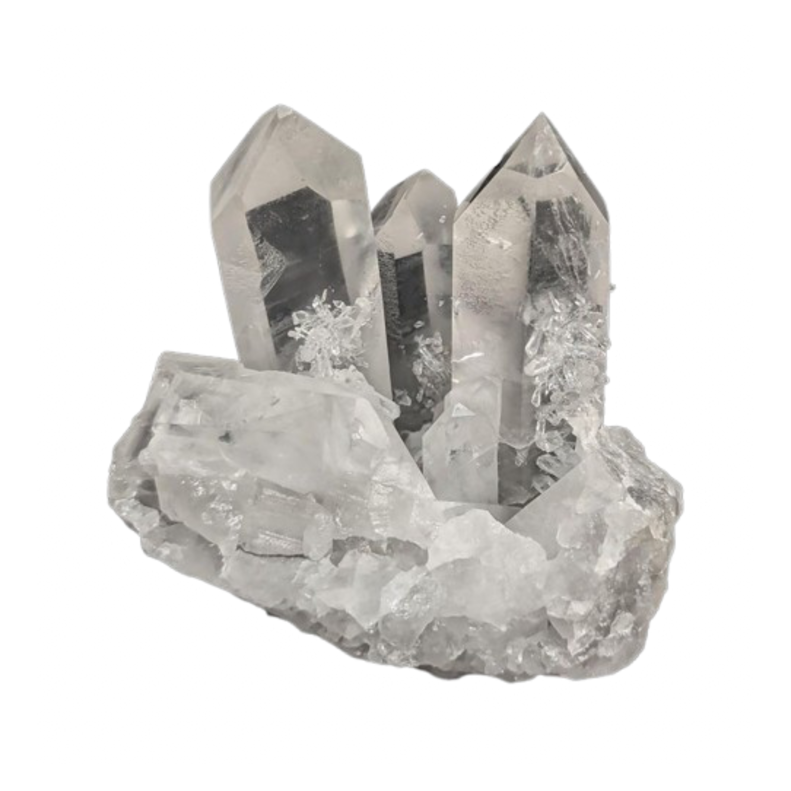

<div align="center">

  

  # Crystal Chatbox
  **A VRChat companion with the most flexible OSC chatbox you've used, plus live world detection, music, weather, heart rate, VR battery, and more.**

  *by CrystalWare Studios — started in 2025*

  <br>

  [**Download Crystal Chatbox (Windows)**](https://github.com/CrystalWare-Studios/Crystal-Chatbox-2026/releases)

  <br>

  <a href="https://discord.gg/uxPdvQkfP5">
    
  </a>
  <a href="https://vrchat.com/home/group/grp_7cd8b94f-90e7-4a86-8ce6-39c4d632fa8b">
    
  </a>

</div>

---

## Features

- **OSC chatbox** with rotating custom messages, per-message timing, weighting, and a live preview of exactly what gets sent.
- **No more cut-off messages** — long text pages through automatically instead of being truncated, and custom borders always stay intact.
- **Custom borders, text effects, and layout spacers** so you control exactly how the box looks and how the lines are spaced.
- **Live VRChat instance** — current world, player count, and join/leave events read straight from the game.
- **Now Playing** — reads whatever's playing automatically on Windows (any player, no setup), or via Last.fm/your own free Spotify app on macOS and Quest — plus **weather**, **time**, **system stats** (CPU/RAM/GPU/network/battery), **heart rate** (Pulsoid / HypeRate), and **AFK** status.
- **VR battery** — headset and controller battery from SteamVR on PC, and the headset's own battery on Quest.
- **System/media volume** — your PC's output volume, or the Quest headset's media volume.
- **Quest storage** — free space remaining on the headset.
- **Avatar OSC reactions** — fire a chatbox message on a gesture, announce avatar changes, and show a live mute indicator.
- **Auto-switch presets by world**, **global hotkeys** for quick phrases, and **session insights**.
- **Active window** display with custom renaming, quick phrases, profiles, and automations.
- **CrystalWare accounts** — optional login with Discord to save your settings and load them on any device.
- **Music via Discord** — reads your currently playing Spotify track straight from your Discord status, as an alternative to Last.fm.
- **Leaderboard** — see the most active Crystal Chatbox users, ranked by time spent in the app.
- **One-click updates** on Windows — no more manually downloading new releases.
- **Weather and time zone by zip code** — set both together in one step.

---

## Platform Support

| Platform | Status | Notes |
|---------|--------|-------|
| **Windows** | Available now | Full feature set|
| **macOS** | Source-available | Full feature set except SteamVR battery. |
| **Android / Quest (.apk)** | Available on github or on the Meta Store|
| **Linux** | Planned | — |

---

## Installation (Windows)

1. Download the latest release from the [Releases](https://github.com/CrystalWare-Studios/Crystal-Chatbox-2026/releases) page.
2. Run the app — it opens its own window, no installer needed.
3. In VRChat, open **Action Menu → Options → OSC → Enable**.
4. Follow the in-app setup guide the first time you open it. It walks you through OSC, your first message, and Now Playing (automatic on Windows — see the FAQ below for macOS/Quest).

## Running from source

Requires Python 3.11+.

```bash
cd "PC/Windows/Crystal-Chatbox-Source-Code/Crystal Chatbox"   # or PC/MacOS/...
python -m venv .venv
.venv\Scripts\activate      # Windows
source .venv/bin/activate   # macOS / Linux
pip install -r requirements.txt
python main.py              # add --nogui to serve to a browser instead of a window
```

---

## FAQ

**How does Now Playing work?**
On Windows, nothing to set up — Crystal reads whatever's currently playing straight from Windows Media, for Spotify, YouTube, or any other player. On Quest, open **Integrations → Now Playing Setup** and enter your Last.fm username (connect your player to Last.fm first if you haven't — the panel walks you through it). On macOS, choose either Last.fm the same way, or bring your own free Spotify developer app: go to [developer.spotify.com/dashboard](https://developer.spotify.com/dashboard), create an app, open **Integrations → Now Playing Setup** in Crystal Chatbox for the exact Redirect URI to add, paste your Client ID and Client Secret, save, then click **Connect Spotify**. You can also log in with Discord to read your Spotify status straight from your Discord activity, on any platform.

**My heart rate isn't showing.**
Enter your Pulsoid token (or HypeRate ID) under Integrations → Heart Rate and make sure the source is turned on.

**The chatbox doesn't appear in VRChat.**
Confirm OSC is enabled in VRChat, then use **Test OSC** in the app. If you just enabled OSC, restart VRChat once.

**Does this get me banned?**
No. Crystal Chatbox only sends standard, allowed OSC chatbox messages — nothing exploitative.

**A long message gets cut off.**
Set the overflow mode to **Page through it** under Appearance → Message Styling; the whole message will cycle a page at a time.

---

## Support

- Discord: https://discord.gg/uxPdvQkfP5
- VRChat group: https://vrchat.com/home/group/grp_7cd8b94f-90e7-4a86-8ce6-39c4d632fa8b

---

## Credits

Developed by CrystalWare Studios. Thanks to the friends and testers who helped shape the features.

---

## License

Crystal Chatbox is source-available and free for personal use. Redistribution, rebranding, and commercial use are not permitted without written permission. See [`LICENSE`](LICENSE).
